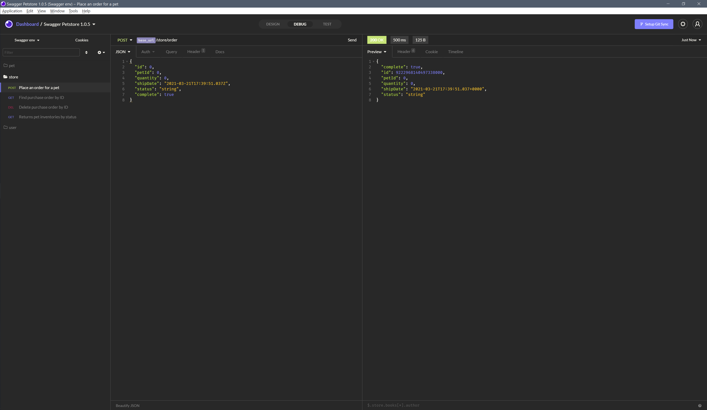

# Insomnia Hiberbee theme

## Installation

- In Insomnia app go to: `Application` > `Preferences` > `Plugins`
- Enter `@hiberbee/insomnia-theme` as npm package name and press `Install plugin`

## Screenshots

